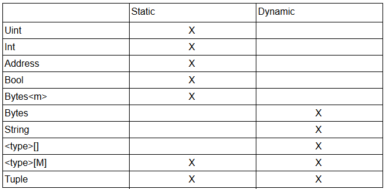

# type.go

该文件主要定义了所有支持编码的数据类型，以及数组与元组的具体编码函数。

### 支持的编码类型

支持的编码类型以枚举类型定义：

```go
const (
	IntTy byte = iota
	UintTy
	BoolTy
	StringTy
	SliceTy
	ArrayTy
	TupleTy
	AddressTy
	FixedBytesTy
	BytesTy
	HashTy
	FixedPointTy
	FunctionTy
)
```



### 数组类型的编码

数组类型的编码首先会在最前端加上长度信息。

若数组中的元素是静态长度的，那么直接逐个追加元素编码值。

若数组中的元素是动态长度的，那么会分成头尾两部分，尾部逐个追加元素编码值，头部则不断追加对应元素从头部初始位置到尾部具体值初始位置之间的偏移量。

```go
func (t Type) pack(v reflect.Value) ([]byte, error) {
	// ...
	switch t.T {
	case SliceTy, ArrayTy: // 数组类型
		var ret []byte

		if t.requiresLengthPrefix() {
      			// 先在最前端加上长度信息
			ret = append(ret, packNum(reflect.ValueOf(v.Len()))...)
		}

		offset := 0
		offsetReq := isDynamicType(*t.Elem)
		if offsetReq {
			offset = getTypeSize(*t.Elem) * v.Len()
		}
		var tail []byte
		for i := 0; i < v.Len(); i++ {
			val, err := t.Elem.pack(v.Index(i)) // 递归编码
			if err != nil {
				return nil, err
			}
      			// 如果数组内的元素是静态长度的，那么直接追加到返回值上
			if !offsetReq {
				ret = append(ret, val...)
				continue
			}
      			// 如果数组内元素是动态长度的，则编码会分成头尾两断
      			// 尾部为具体的值的编码
      			// 头部为各项在尾部的位置索引
			ret = append(ret, packNum(reflect.ValueOf(offset))...)
			offset += len(val)
			tail = append(tail, val...)
		}
		return append(ret, tail...), nil
	case TupleTy: // 元组类型
		// ...
	default:
		return packElement(t, v)
	}
}
```

非数组和元组类型的数据，其编码函数定义在末尾的 packElement(t, v) 中，该函数定义于 [pack.go](pack.go.md) 中。

例如，数组 bytes<3>\[] = \[0x456, 0x789] 的编码为（为了可读性，添加了换行以及注释）：

```
0x0000000000000000000000000000000000000000000000000000000000000002  // 长度信息
0x0000000000000000000000000000000000000000000000000000000000000456  // 第一个元素
0x0000000000000000000000000000000000000000000000000000000000000789  // 第二个元素
```

如果数组元素为动态长度，则会是以头尾两部分表示，数组 string\[] = \["ab", "Hello, world!"] 的编码为：

```
0x0000000000000000000000000000000000000000000000000000000000000002 // 长度信息
// 头部
// 第一个字符串距离头部起始点的偏移量，此处为 64
0x0000000000000000000000000000000000000000000000000000000000000040 
// 第二个字符串距离头部起始点的偏移量，此处为 128
0x0000000000000000000000000000000000000000000000000000000000000080 
// 尾部
// "ab" 的编码值
0x0000000000000000000000000000000000000000000000000000000000000002 // 元素长度
0x6162000000000000000000000000000000000000000000000000000000000000 // 元素编码
// "Hello, world!" 的编码值
0x000000000000000000000000000000000000000000000000000000000000000d // 元素长度
0x48656c6c6f2c20776f726c642100000000000000000000000000000000000000 // 元素编码
```

### 元组类型的编码

元组类型的编码也是分为头尾两部分。并且逐个遍历其中元素。

当元素为静态长度时，直接在头部追加其编码值，尾部不做操作。

当元素为动态类型时，在尾部追加其编码值，头部则追加对应元素从头部初始位置到尾部具体值初始位置之间的偏移量（与数组对动态长度元素的操作一致）。

```go
func (t Type) pack(v reflect.Value) ([]byte, error) {
	// ...
	switch t.T {
	case SliceTy, ArrayTy: // 数组类型
		// ...
	case TupleTy: // 元组类型
		fieldmap, err := mapArgNamesToStructFields(t.TupleRawNames, v)
		if err != nil {
			return nil, err
		}

		offset := 0
		for _, elem := range t.TupleElems {
			offset += getTypeSize(*elem)
		}
		var ret, tail []byte
		for i, elem := range t.TupleElems { // 遍历元组内的各个元素
			field := v.FieldByName(fieldmap[t.TupleRawNames[i]])
			if !field.IsValid() {
				return nil, fmt.Errorf("field %s for tuple not found in the given struct", t.TupleRawNames[i])
			}
			val, err := elem.pack(field) // 递归编码
			if err != nil {
				return nil, err
			}
      			// 元组编码会分成头尾两断
			if isDynamicType(*elem) {
        			// 如果当前元素是动态长度的，那么在头部追加位置索引
        			// 在尾部追加值
				ret = append(ret, packNum(reflect.ValueOf(offset))...)
				tail = append(tail, val...)
				offset += len(val)
			} else {
        			// 如果当前元素是静态长度的，那么直接在头部追加值
        			// 尾部不追加任何值
				ret = append(ret, val...)
			}
		}
		return append(ret, tail...), nil

	default:
		return packElement(t, v)
	}
}
```

元组类型 (uint256, string) = (5678, "Hello World") 的编码为：

```
// 头部
// 第一个元素是固定长度，所以就是其编码值
0x000000000000000000000000000000000000000000000000000000000000162e
// 第二个元素是动态长度，所以这里值为距离头部起始点的偏移量，此处为 64
0x0000000000000000000000000000000000000000000000000000000000000040
// 尾部
// 由于第一个值是固定长度，所以这里以第二元素的具体值开始
0x000000000000000000000000000000000000000000000000000000000000000b
0x48656c6c6f20576f726c64000000000000000000000000000000000000000000
```

